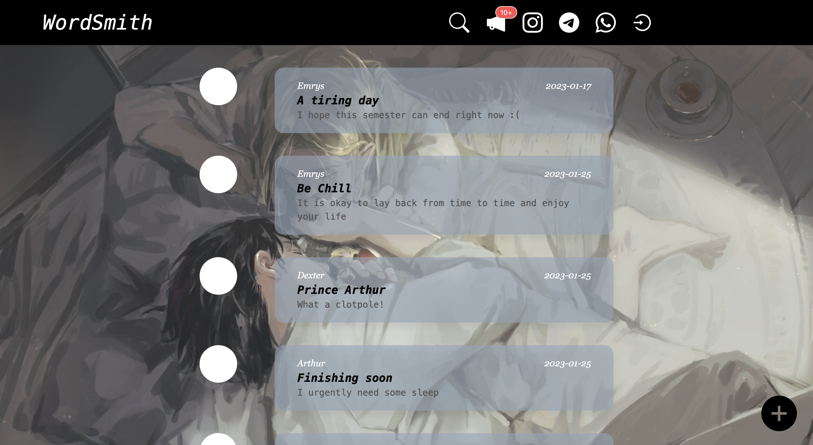
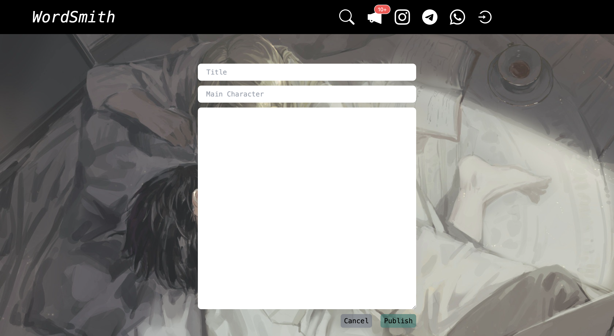
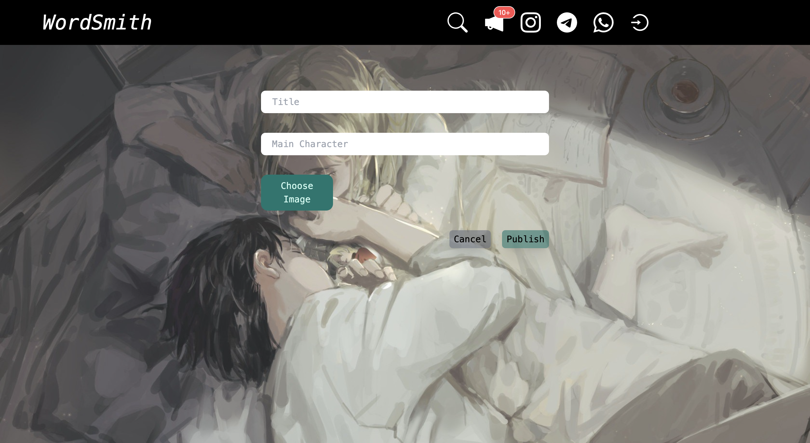

# WordSmith
WordSmith is an open-source, blog platform.
You can upload pictures, articles and videos and meet link-minded individuals!

## To Start

From the project directory, cd to /client, run:

`npm start`: This Runs the app in the development mode. You can open [http://localhost:3000](http://localhost:3000/) to view it in your browser.

------

From the project directory, cd to /api, run:

`npm start`: This starts the server at port 2333 of localhost.

## Project showcase

### Home page

### Login page

### Search page

### Publish page

